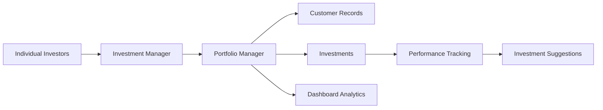
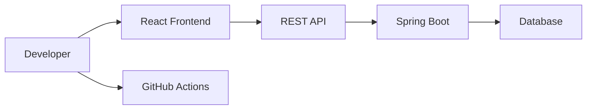
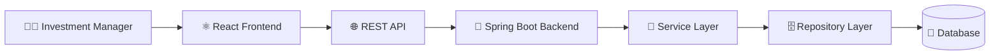
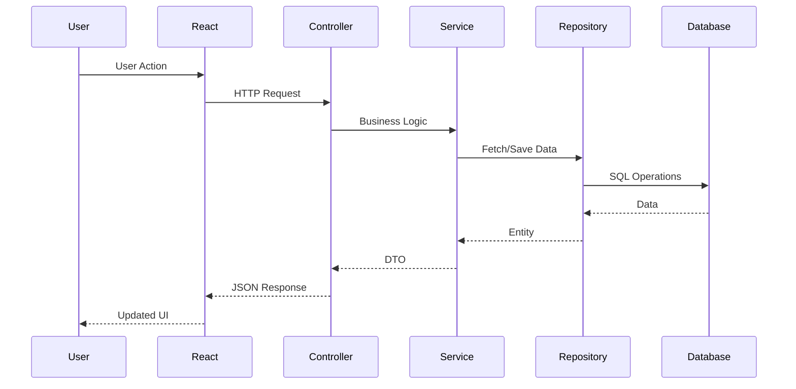
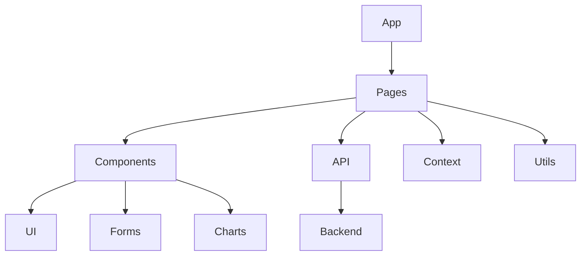
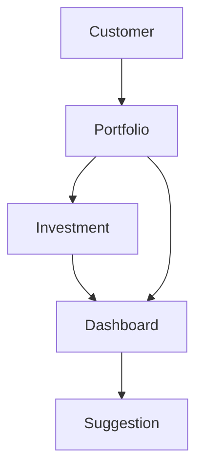
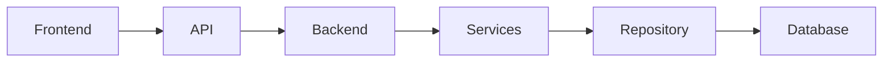

<!-- ========================================================= -->
<!--                    PORTFOLIO MANAGER                       -->
<!--                     HERO SECTION                           -->
<!-- ========================================================= -->

<div align="center">

# 📈 Portfolio Manager

### **A Premium Full-Stack Investment Portfolio Management Platform**

*Empowering investment managers with intelligent portfolio tracking, customer management, performance analytics, and data-driven investment insights.*

<br>

<p align="center">


</p>

<p align="center">


</p>

---

### 💼 Investment Manager → Portfolio Intelligence → Better Financial Decisions

*A modern command center for managing investors, portfolios, assets, and performance through a clean, scalable full-stack architecture.*

---

### 🚀 Quick Navigation

| | |
|---|---|
| 📖 About | Product overview |
| ✨ Features | Core capabilities |
| 🏗 Architecture | System design |
| ⚙ Installation | Backend & Frontend setup |
| 📸 Screenshots | UI showcase |
| 📚 Documentation | PRD & Design |
| 👨‍💻 Developers | Meet the team |
| 🛣 Roadmap | Future enhancements |

---

> **Designed as a premium fintech experience inspired by modern investment platforms, combining intelligent analytics, scalable architecture, and an elegant user experience.**

</div>

---

## 🌟 Why Portfolio Manager?

Managing investments should be **intelligent**, **transparent**, and **efficient**.

Portfolio Manager provides a centralized platform that enables investment managers to:

- 👥 Manage multiple customer portfolios
- 📈 Monitor portfolio performance
- 💰 Track investment growth
- 🥧 Visualize asset allocation
- 💡 Generate intelligent investment suggestions
- 📊 Make informed financial decisions through analytics

---

<div align="center">

### ⭐ If you find this project helpful, consider giving it a star!

<!-- ========================================================= -->
<!--                      ABOUT PROJECT                         -->
<!-- ========================================================= -->

# 🌍 About Portfolio Manager

## 📖 Product Overview

**Portfolio Manager** is a modern full-stack Investment Portfolio Management System designed to simplify how investment managers oversee customer portfolios, monitor financial performance, and make informed investment decisions.

The platform centralizes customer information, investment records, portfolio analytics, and actionable insights into a single, intuitive dashboard, enabling efficient portfolio management and better financial decision-making.

---

# 🎯 Vision

To provide investment managers with a centralized, intelligent, and scalable platform that transforms complex portfolio management into a seamless digital experience.

The system focuses on delivering:

- 📊 Complete portfolio visibility
- 📈 Accurate performance analytics
- 👥 Efficient customer management
- 💡 Intelligent investment suggestions
- 🔒 Reliable and maintainable architecture

---

# 💼 Business Context

Investment managers act as intermediaries between investors and financial markets.

The platform digitizes this workflow by allowing managers to record investments, monitor returns, and provide data-driven portfolio insights.

```text
Individual Investors
        │
        ▼
Investment Manager
        │
        ▼
Portfolio Manager Platform
        │
 ┌──────┼────────┐
 ▼      ▼        ▼
Customers Investments Dashboard
        │
        ▼
 Portfolio Analytics
        │
        ▼
Investment Suggestions
```

---

# 🔄 Product Workflow



---

# 🎯 Objectives

The application is designed to help investment managers:

✅ Organize customer information

✅ Track investments

✅ Calculate portfolio performance

✅ Monitor profit and loss

✅ Analyze asset allocation

✅ Generate investment suggestions

✅ Improve investment decision making

---

# ✨ Core Functionalities

## 👥 Customer Management

Manage investor profiles with complete customer information.

### Features

- Create customers
- View customer profiles
- Update customer details
- Delete customer records
- Store investment goals
- Maintain risk profiles

---

## 💹 Investment Management

Track and manage customer investments across multiple assets.

### Features

- Record investments
- Monitor holdings
- Update investment information
- Delete investments
- Track purchase history

---

## 📊 Portfolio Performance

Automatically calculate important investment metrics.

Including:

- Portfolio Value
- Investment Cost
- Profit / Loss
- Return Percentage
- Overall Growth

---

## 🥧 Asset Allocation

Visualize how investments are distributed across asset classes.

Examples include:

- Stocks
- Bonds
- Cash
- Other Assets

Interactive charts provide a quick understanding of portfolio diversification.

---

## 💡 Investment Suggestions

Provide intelligent portfolio insights based on customer investments.

Examples include:

- Diversification recommendations
- Risk profile analysis
- Portfolio balancing suggestions
- Investment concentration warnings

---

# 🚀 Why This Project?

Managing multiple customer portfolios manually is time-consuming and prone to errors.

Portfolio Manager streamlines the entire investment management lifecycle by bringing customer data, investment tracking, analytics, and reporting into one unified platform.

The result is a smarter, faster, and more reliable investment management experience.

---

# 🏆 Key Benefits

| Benefit | Description |
|----------|-------------|
| 📈 Better Decisions | Data-driven portfolio insights |
| 👥 Customer Management | Centralized investor information |
| 💹 Performance Tracking | Real-time portfolio monitoring |
| 📊 Portfolio Analytics | Visual performance metrics |
| 🥧 Asset Allocation | Interactive distribution charts |
| 💡 Smart Suggestions | Actionable investment recommendations |
| ⚡ Productivity | Reduced manual effort |
| 🛡️ Scalable Architecture | Designed for future enhancements |

---

# 🎖️ Highlights

<div align="center">

| Feature | Status |
|---------|--------|
| Customer Management | ✅ |
| Investment Tracking | ✅ |
| Portfolio Analytics | ✅ |
| Dashboard | ✅ |
| Asset Allocation | ✅ |
| Performance Charts | ✅ |
| Investment Suggestions | ✅ |
| Responsive UI | ✅ |
| REST API | ✅ |
| Spring Boot Backend | ✅ |
| React Frontend | ✅ |

</div>

---

<div align="center">

### 💡 *"Turning investment data into actionable intelligence."*

</div>

<!-- ========================================================= -->
<!--                    FEATURES SECTION                        -->
<!-- ========================================================= -->

# ✨ Core Features

Portfolio Manager is built to provide investment managers with a centralized, intelligent, and scalable platform for managing customer portfolios and making data-driven financial decisions.

---

# 🚀 Feature Overview

<div align="center">

| Module | Description | Status |
|---------|-------------|:------:|
| 👥 Customer Management | Manage investor information | ✅ |
| 💹 Investment Management | Track customer investments | ✅ |
| 📊 Portfolio Dashboard | Financial overview & KPIs | ✅ |
| 📈 Performance Analytics | Portfolio growth tracking | ✅ |
| 🥧 Asset Allocation | Interactive allocation charts | ✅ |
| 💡 Investment Suggestions | Smart portfolio insights | ✅ |
| 🌙 Theme Support | Light & Dark Mode | ✅ |
| 📱 Responsive UI | Desktop, Tablet & Mobile | ✅ |

</div>

---

# 👥 Customer Management

Manage investor profiles with complete customer information.

### Features

- ➕ Create customer profiles
- 👀 View customer details
- ✏️ Update customer information
- ❌ Delete customer records
- 📧 Store contact information
- 🎯 Record investment goals
- ⚠️ Maintain customer risk profiles

---

# 💹 Investment Management

Track and manage investments across multiple customer portfolios.

### Features

- ➕ Add new investments
- 📄 View investment history
- ✏️ Update investment details
- ❌ Remove investments
- 💰 Track purchase prices
- 📈 Monitor current values
- 🗓️ Store purchase dates

---

# 📊 Dashboard Analytics

Gain instant visibility into overall portfolio performance.

### Dashboard Includes

- 👥 Total Customers
- 💰 Assets Under Management
- 📈 Portfolio Value
- 📉 Profit & Loss
- 📊 Performance Metrics
- 🥧 Allocation Summary
- 💡 Investment Insights

---

# 📈 Portfolio Performance

Automatically calculate key investment metrics.

### Performance Indicators

- Total Investment Amount
- Current Portfolio Value
- Net Profit / Loss
- Return Percentage
- Individual Customer Performance
- Portfolio Growth

---

# 🥧 Asset Allocation

Understand portfolio diversification through visual analytics.

Supported asset categories include:

- 📈 Stocks
- 🏦 Bonds
- 💵 Cash
- 📦 Other Assets

Visualization includes:

- Pie Charts
- Allocation Percentages
- Distribution Summaries

---

# 💡 Smart Investment Suggestions

Receive intelligent recommendations based on portfolio composition.

Examples include:

### 📊 Diversification Alerts

Detect excessive concentration within a single asset category.

---

### ⚠️ Risk Analysis

Compare customer risk profile with current portfolio allocation.

---

### 📈 Portfolio Optimization

Identify opportunities to improve balance and long-term performance.

---

# 🎨 Premium User Experience

Designed with a modern fintech experience in mind.

### Highlights

- ✨ Glassmorphism-inspired interface
- 🌙 Light / Dark Theme
- 📱 Responsive layouts
- 🎯 Intuitive navigation
- ⚡ Fast interactions
- 🔔 Toast notifications
- 🦴 Skeleton loading states
- 🛡️ Error boundaries

---

# ⚙️ Backend Features

Built using a clean layered architecture.

### Includes

- RESTful APIs
- Spring Boot
- DTO-based communication
- Service Layer
- Repository Layer
- Global Exception Handling
- CORS Configuration
- Database Initialization

---

# 💻 Frontend Features

Modern React application powered by Vite.

### Includes

- Component-based architecture
- Context API
- Reusable UI components
- Forms & Validation
- Performance Charts
- Allocation Charts
- API Service Layer
- Responsive Pages

---

# 📊 Feature Matrix

| Category | Capability |
|----------|------------|
| Customer Management | CRUD Operations |
| Investment Management | CRUD Operations |
| Portfolio Tracking | Performance Monitoring |
| Dashboard | Analytics & KPIs |
| Charts | Performance & Allocation |
| Suggestions | Diversification & Risk Insights |
| UI | Responsive Design |
| Theme | Light & Dark Mode |
| Notifications | Toast Messages |
| Backend | REST APIs |
| Database | Schema Initialization |
| Architecture | Layered Design |

---

# 🌟 What Makes Portfolio Manager Different?

✅ Centralized investment management

✅ Intelligent portfolio insights

✅ Modern full-stack architecture

✅ Clean and responsive interface

✅ Data-driven performance analytics

✅ Scalable backend design

✅ Interactive visualizations

✅ Professional user experience

---

<div align="center">

## 🚀 Built for smarter investment management.

*From customer onboarding to portfolio analytics, every feature is designed to simplify financial decision-making.*

</div>

<!-- ========================================================= -->
<!--                    TECHNOLOGY STACK                        -->
<!-- ========================================================= -->

# 🛠️ Technology Stack

Portfolio Manager is built using a modern full-stack technology ecosystem that emphasizes **performance**, **scalability**, **maintainability**, and **developer productivity**.

---

# 🚀 Technology Overview

<div align="center">

| Layer | Technology |
|--------|------------|
| 🎨 Frontend | React + Vite |
| ⚙️ Backend | Spring Boot |
| ☕ Language | Java 17 |
| 🗄️ Database | SQL (Schema & Seed Data) |
| 🔗 API | REST |
| 📦 Build Tool | Maven |
| 🌐 Version Control | Git & GitHub |
| 🤖 CI/CD | GitHub Actions |

</div>

---

# 🎨 Frontend Technologies

<div align="center">

| Technology | Purpose |
|------------|---------|
| ⚛️ React | Component-based UI |
| ⚡ Vite | Fast development & build tool |
| 🧩 JSX | Declarative UI development |
| 🎨 CSS3 | Responsive styling |
| 📊 Charts | Portfolio & Allocation Visualization |
| 🔄 Context API | Global state management |
| 🌐 Fetch/API Layer | Backend communication |

</div>

### Why React?

- Reusable Components
- Virtual DOM
- Fast Rendering
- Excellent Developer Experience
- Scalable Project Structure

---

# ⚙️ Backend Technologies

<div align="center">

| Technology | Purpose |
|------------|---------|
| ☕ Java 17 | Core Programming Language |
| 🍃 Spring Boot | REST API Framework |
| 📦 Spring Data JPA | Database Access Layer |
| 🧱 DTO Pattern | Secure API Communication |
| 🗂️ Repository Pattern | Data Persistence |
| ⚠️ Global Exception Handler | Error Handling |
| 🌍 CORS Configuration | Frontend Integration |

</div>

### Why Spring Boot?

- Enterprise-grade framework
- Rapid REST API development
- Dependency Injection
- Clean Architecture
- Strong ecosystem
- Production-ready features

---

# 🗄️ Database Layer

The backend initializes the database using SQL scripts.

### Database Components

- Schema Initialization
- Seed Data
- Customer Table
- Portfolio Table
- Investment Table

---

# 📡 API Layer

Communication between the frontend and backend occurs through RESTful APIs.

```text
React Frontend
       │
       ▼
 REST API Layer
       │
       ▼
 Spring Boot Backend
       │
       ▼
 Database
```

---

# 🏗️ Application Architecture

```text
Presentation Layer
        │
        ▼
React Components
        │
        ▼
API Service Layer
        │
        ▼
Spring Controllers
        │
        ▼
Service Layer
        │
        ▼
Repository Layer
        │
        ▼
Database
```

---

# 📂 Backend Architecture

```text
Controller
     │
     ▼
Service
     │
     ▼
Repository
     │
     ▼
Database
```

---

# 🎨 Frontend Architecture

```text
Pages
 │
 ├── Components
 │      │
 │      ├── UI
 │      ├── Charts
 │      ├── Forms
 │      └── Layout
 │
 ├── Context
 │
 ├── API Services
 │
 └── Utilities
```

---

# 📦 Development Tools

| Tool | Purpose |
|------|---------|
| Git | Version Control |
| GitHub | Repository Hosting |
| GitHub Actions | Continuous Integration |
| Maven | Dependency Management |
| npm | Frontend Package Management |
| Vite | Development Server |
| VS Code / IntelliJ IDEA | Development Environment |

---

# 📊 Technology Comparison

| Category | Selected Technology | Why? |
|----------|---------------------|------|
| Frontend | React | Reusable component architecture |
| Build Tool | Vite | Lightning-fast development |
| Backend | Spring Boot | Enterprise-ready REST framework |
| Language | Java 17 | Stability and scalability |
| Persistence | Spring Data JPA | Simplified data access |
| Build | Maven | Dependency & lifecycle management |
| Version Control | Git | Collaborative development |
| CI/CD | GitHub Actions | Automated validation |

---

# 🌟 Key Advantages

## ⚡ Performance

- Fast frontend builds with Vite
- Optimized backend using Spring Boot
- Efficient REST communication

---

## 🔒 Scalability

- Layered architecture
- Modular codebase
- Reusable components
- Service-oriented backend

---

## 🧩 Maintainability

- Separation of concerns
- DTO-based API design
- Repository pattern
- Reusable UI components

---

## 🎨 User Experience

- Responsive layouts
- Interactive charts
- Theme support
- Modern UI components
- Smooth navigation

---

# 📈 Development Workflow



---

# 💼 Why This Stack?

This technology stack combines modern frontend development with enterprise-grade backend architecture, delivering a solution that is:

- 🚀 Fast
- 🔒 Reliable
- 📈 Scalable
- 🧩 Maintainable
- 💻 Developer Friendly
- 🌐 Production Ready

---

<div align="center">

## ⚙️ Built with Modern Technologies

**React • Vite • Spring Boot • Java • REST APIs • Maven • GitHub Actions**

</div>

<!-- ========================================================= -->
<!--                 SYSTEM ARCHITECTURE                        -->
<!-- ========================================================= -->

# 🏗️ System Architecture

Portfolio Manager follows a **layered architecture** that separates presentation, business logic, and data persistence. This design improves scalability, maintainability, and testability while keeping responsibilities well-defined across the application.

---

# 🌐 High-Level Architecture



---

# 🔄 Request Lifecycle



---

# 🏛️ Backend Layered Architecture

```text
Presentation Layer
        │
        ▼
REST Controllers
        │
        ▼
Business Services
        │
        ▼
Repositories
        │
        ▼
Database
```

---

# 📦 Backend Responsibilities

## 🎯 Controller Layer

Responsible for

- Receiving HTTP requests
- Validating incoming data
- Returning API responses
- Delegating business logic

Examples

- CustomerController
- InvestmentController
- DashboardController
- SuggestionController

---

## 🧠 Service Layer

Contains all business logic.

Responsibilities

- Portfolio calculations
- Customer operations
- Investment processing
- Dashboard generation
- Suggestion engine

---

## 🗄 Repository Layer

Acts as the communication bridge with the database.

Responsibilities

- CRUD operations
- Data persistence
- Query execution
- Entity retrieval

---

## 💾 Database Layer

Stores

- Customers
- Portfolios
- Investments

Initialized using

- schema.sql
- data.sql

---

# ⚛️ Frontend Architecture



---

# 🎨 Frontend Design Flow

```text
Pages
 │
 ├── Layout
 │
 ├── Components
 │     ├── Charts
 │     ├── Forms
 │     ├── UI
 │     └── Layout
 │
 ├── Context
 │
 ├── API
 │
 └── Utilities
```

---

# 🔗 API Communication

```mermaid
flowchart LR

React

React --> Axios/API Layer

API Layer --> REST Endpoints

REST Endpoints --> Services

Services --> Repository

Repository --> Database
```

---

# 📊 Module Relationships



---

# 🎯 Design Principles

## Separation of Concerns

Every layer performs one responsibility only.

---

## Reusability

Frontend components and backend services are designed for reuse.

---

## Scalability

New modules can be added without changing existing architecture.

---

## Maintainability

Clear folder organization and layered architecture improve long-term maintenance.

---

## Extensibility

Future enhancements such as authentication, live market data, reporting, and AI recommendations can be integrated without major architectural changes.

---

# 🏆 Architectural Highlights

| Principle | Benefit |
|------------|----------|
| Layered Architecture | Better separation of responsibilities |
| REST APIs | Decoupled frontend and backend |
| DTO Pattern | Secure API communication |
| Repository Pattern | Simplified persistence |
| Modular React Components | High reusability |
| Context API | Shared application state |
| Responsive UI | Better user experience |
| Clean Project Structure | Easier maintenance |

---

# 🚀 End-to-End Flow

```text
Investment Manager

        │

        ▼

React Dashboard

        │

REST API

        │

Spring Boot

        │

Business Logic

        │

Repositories

        │

Database

        │

Portfolio Analytics

        │

Investment Insights
```

---

<div align="center">

## 🏛️ Clean Architecture • Scalable Design • Enterprise Ready

</div>

<!-- ========================================================= -->
<!--                 PROJECT STRUCTURE                          -->
<!-- ========================================================= -->

# 📁 Project Structure

Portfolio Manager is organized into two primary applications:

- ⚛️ Frontend (React + Vite)
- 🍃 Backend (Spring Boot)

This separation enables independent development, testing, and deployment while maintaining a clean full-stack architecture.

---

# 🗂 Repository Structure

```text
capstone/
│
├── .github/
│   └── workflows/
│       └── ci.yml
│
├── backend/
│
├── frontend/
│
├── Portfolio_Manager_PRD.md
│
└── README.md
```

---

# ⚛️ Frontend Structure

```text
frontend/
│
├── public/
│
├── mock-data/
│
├── src/
│   │
│   ├── api/
│   │
│   ├── assets/
│   │
│   ├── components/
│   │     ├── charts/
│   │     ├── forms/
│   │     ├── layout/
│   │     └── ui/
│   │
│   ├── context/
│   │
│   ├── pages/
│   │
│   ├── utils/
│   │
│   ├── App.jsx
│   └── main.jsx
│
├── package.json
└── vite.config.js
```

---

## 📦 Frontend Directory Responsibilities

| Folder | Responsibility |
|----------|----------------|
| api | Backend communication |
| assets | Images & static assets |
| components | Reusable UI components |
| charts | Data visualizations |
| forms | User input forms |
| layout | Application layout |
| ui | Shared UI elements |
| context | Global application state |
| pages | Route-level screens |
| utils | Utility functions |

---

# 🍃 Backend Structure

```text
backend/
│
├── src/
│
│   ├── main/
│   │
│   ├── java/
│   │
│   │   └── com/backend/
│   │
│   │       ├── config/
│   │       ├── controller/
│   │       ├── dto/
│   │       ├── entity/
│   │       ├── exception/
│   │       ├── repository/
│   │       ├── service/
│   │       └── BackendApplication.java
│   │
│   └── resources/
│       ├── application.properties
│       ├── schema.sql
│       └── data.sql
│
└── pom.xml
```

---

## 📦 Backend Directory Responsibilities

| Folder | Responsibility |
|----------|----------------|
| config | Application configuration |
| controller | REST endpoints |
| dto | Request & response models |
| entity | Database entities |
| repository | Data access |
| service | Business logic |
| exception | Global error handling |
| resources | Configuration & SQL scripts |

---

# 📊 Application Flow



---

# 📂 Configuration Files

| File | Purpose |
|------|----------|
| package.json | Frontend dependencies |
| vite.config.js | Vite configuration |
| pom.xml | Maven dependencies |
| application.properties | Spring Boot configuration |
| schema.sql | Database schema |
| data.sql | Seed data |
| ci.yml | GitHub Actions workflow |

---

# 🎨 UI Organization

```text
Components

├── Charts

├── Forms

├── Layout

└── UI
```

Each component category has a single responsibility and is designed for reuse throughout the application.

---

# 🧠 Backend Organization

```text
Controllers

↓

Services

↓

Repositories

↓

Database
```

Business logic remains isolated from presentation and persistence layers, improving maintainability.

---

# 📈 Scalability

The project structure is designed to support future enhancements such as:

- 🔐 Authentication & Authorization
- ☁️ Cloud Deployment
- 📊 Advanced Reporting
- 📈 Live Market Data
- 🤖 AI-powered Investment Recommendations
- 📩 Notifications
- 📜 Transaction History

---

# ✅ Structure Highlights

- Modular architecture
- Feature-based organization
- Clear separation of concerns
- Reusable UI components
- Layered backend design
- Enterprise-ready folder layout
- Easy onboarding for new developers
- Scalable project foundation

---

<div align="center">

## 📁 Organized Code • Clean Architecture • Built to Scale

</div>
<!-- ========================================================= -->
<!--                 APPLICATION SHOWCASE                       -->
<!-- ========================================================= -->

# 📸 Application Showcase

Experience the **Portfolio Manager** through a collection of intuitive, modern, and data-driven interfaces designed for investment managers.

> **📢 Note**
>
> Replace the placeholder images below with actual screenshots after deployment.

---

# 🖥️ Dashboard

<p align="center">


</p>

### Highlights

- 📊 Portfolio Summary
- 💰 Assets Under Management
- 📈 Portfolio Performance
- 🥧 Asset Allocation
- 📉 Profit & Loss
- 💡 Investment Insights

---

# 👥 Customer Management

<p align="center">


</p>

### Features

- Customer Directory
- Customer Profiles
- Risk Profile
- Investment Goals
- Portfolio Summary

---

# 💹 Investment Management

<p align="center">


</p>

### Features

- Holdings
- Purchase History
- Current Market Value
- Asset Types
- Performance Tracking

---

# 📈 Portfolio Analytics

<p align="center">


</p>

### Analytics

- Growth Trends
- Return Percentage
- Historical Performance
- Portfolio Value
- Interactive Charts

---

# 🥧 Asset Allocation

<p align="center">


</p>

Visualize portfolio diversification across different asset categories.

---

# 💡 Investment Suggestions

<p align="center">


</p>

Receive intelligent recommendations based on:

- Diversification
- Risk Profile
- Portfolio Balance
- Investment Concentration

---

# 🌙 Theme Support

<table>
<tr>

<td align="center">

### ☀️ Light Theme


</td>

<td align="center">

### 🌙 Dark Theme


</td>

</tr>
</table>

---

# 📱 Responsive Experience

<div align="center">

| Desktop | Tablet | Mobile |
|----------|---------|---------|
| 🖥️ | 📱 | 📲 |

</div>

Responsive layouts ensure a consistent experience across all devices.

---

# 📂 Screenshot Folder

```text
screenshots/
│
├── dashboard.png
├── customers.png
├── investments.png
├── performance.png
├── allocation.png
├── suggestions.png
├── light-theme.png
└── dark-theme.png
```

---

<div align="center">

## 📷 Premium FinTech Experience

*A modern interface built for clarity, intelligence, and professional portfolio management.*

</div>
<!-- ========================================================= -->
<!--                 INSTALLATION GUIDE                         -->
<!-- ========================================================= -->

# ⚙️ Installation Guide

Follow the steps below to set up **Portfolio Manager** locally.

---

# 📋 Prerequisites

Ensure the following software is installed before you begin.

| Software | Version |
|-----------|---------|
| Java | 17+ |
| Maven | Latest |
| Node.js | 18+ |
| npm | Latest |
| Git | Latest |

---

# 📥 Clone the Repository

```bash
git clone https://github.com/<your-username>/Portfolio-Manager.git

cd Portfolio-Manager
```

---

# 🍃 Backend Setup

Navigate to the backend folder.

```bash
cd backend
```

---

## Install Dependencies

Linux / macOS

```bash
./mvnw clean install
```

Windows

```bash
mvnw.cmd clean install
```

---

## Run the Backend

Linux / macOS

```bash
./mvnw spring-boot:run
```

Windows

```bash
mvnw.cmd spring-boot:run
```

---

Backend will start at

```text
http://localhost:8080
```

---

# ⚛️ Frontend Setup

Open another terminal.

```bash
cd frontend
```

Install dependencies.

```bash
npm install
```

---

## Start the Development Server

```bash
npm run dev
```

Frontend will be available at

```text
http://localhost:5173
```

---

# 🌐 Running the Application

Start the backend first.

```text
localhost:8080
```

Then launch the frontend.

```text
localhost:5173
```

Open the frontend in your browser and begin exploring the application.

---

# 🔄 Build for Production

### Frontend

```bash
npm run build
```

---

### Backend

```bash
./mvnw clean package
```

or on Windows

```bash
mvnw.cmd clean package
```

---

# 🧪 Run Tests

Backend

```bash
mvn test
```

Frontend

```bash
npm run lint
```

---

# 📦 Environment Configuration

See the dedicated **Environment Configuration** section below for full details and examples.

---

# 🛠️ Common Commands

| Command | Purpose |
|----------|---------|
| `npm install` | Install frontend packages |
| `npm run dev` | Start frontend |
| `npm run build` | Production build |
| `./mvnw spring-boot:run` | Run backend |
| `./mvnw clean package` | Build backend |
| `mvn test` | Run backend tests |
| `npm run lint` | Lint frontend |

---

# 🚀 You're Ready!

Once both services are running:

- 🌐 Frontend → `http://localhost:5173`
- 🍃 Backend → `http://localhost:8080`

You can now explore the Portfolio Manager dashboard and its investment management features.

---

<div align="center">

## 🎉 Happy Coding!

**Thank you for trying Portfolio Manager.**

</div>
<!-- ========================================================= -->
<!--              ENVIRONMENT CONFIGURATION                     -->
<!-- ========================================================= -->

# 🔐 Environment Configuration

Portfolio Manager uses environment variables to configure communication between the frontend and backend.

---

## Frontend

Create a `.env` file inside the `frontend` directory.

```text
frontend/
│
├── .env
└── src/
```

Example:

```env
VITE_USE_MOCK=false
VITE_API_URL=http://localhost:8080
```

---

## Available Variables

| Variable | Description | Default |
|-----------|-------------|---------|
| VITE_API_URL | Backend API Base URL | http://localhost:8080 |

---

## Development

```env
VITE_API_URL=http://localhost:8080
```

---

## Production

```env
VITE_API_URL=https://your-domain.com/api
```

---

## Security Notes

- Never commit sensitive environment variables.
- Keep production secrets outside the repository.
- Use separate environment files for development and production.

---

## Verify Configuration

Start both services:

```bash
# Backend
./mvnw spring-boot:run

# Frontend
npm run dev
```

Open:

```
http://localhost:5173
```

If the dashboard loads successfully, the frontend is communicating with the backend.

<!-- ========================================================= -->
<!--                    API DOCUMENTATION                       -->
<!-- ========================================================= -->

# 🔌 REST API

Portfolio Manager exposes RESTful APIs for managing customers, investments, dashboard analytics, and investment suggestions.

---

# 🌐 Base URL

```
http://localhost:8080
```

---

# 👥 Customer APIs

| Method | Endpoint | Description |
|---------|----------|-------------|
| GET | `/customers` | Retrieve all customers |
| GET | `/customers/{id}` | Retrieve a customer |
| POST | `/customers` | Create a customer |
| PUT | `/customers/{id}` | Update a customer |
| DELETE | `/customers/{id}` | Delete a customer |

---

# 💹 Investment APIs

| Method | Endpoint | Description |
|---------|----------|-------------|
| GET | `/customers/{id}/investments` | View investments |
| POST | `/customers/{id}/investments` | Add investment |
| PUT | `/investments/{id}` | Update investment |
| DELETE | `/investments/{id}` | Delete investment |

---

# 📊 Dashboard APIs

| Method | Endpoint | Description |
|---------|----------|-------------|
| GET | `/dashboard/summary` | Dashboard summary |
| GET | `/dashboard/allocation` | Portfolio allocation |
| GET | `/customers/{id}/performance` | Portfolio performance |

---

# 💡 Suggestions

| Method | Endpoint | Description |
|---------|----------|-------------|
| GET | `/suggestions` | Investment recommendations |

---

# 📦 Example Response

```json
{
  "id": 1,
  "name": "Rahul Sharma",
  "email": "rahul@example.com",
  "riskProfile": "Moderate",
  "investmentGoal": "Long-Term Wealth Creation"
}
```

---

# 📡 API Flow

```mermaid
flowchart LR

React

↓

REST API

↓

Spring Boot

↓

Service Layer

↓

Repository

↓

Database
```

---

## Future Improvements

- Swagger / OpenAPI Documentation
- JWT Authentication
- Versioned APIs
- Rate Limiting
- API Monitoring

<!-- ========================================================= -->
<!--                  DEVELOPMENT TEAM                          -->
<!-- ========================================================= -->

# 👨‍💻 Meet the Developers

<div align="center">

### Built with Collaboration, Innovation & Engineering Excellence

</div>

---

<div align="center">

<table>

<tr>

<td align="center" width="25%">


### 👨‍💻 Priyanshu

**Frontend Engineer**

[](https://github.com/priyanshuk6395)


</td>

<td align="center" width="25%">


### 👨‍💻 Ayush

**Backend Engineer**

[](https://github.com/ayushsh2005)


</td>

</tr>

<tr>

<td align="center" width="25%">


### 👨‍💻 Pallavi

**Full Stack Developer**

[](https://github.com/pallavi886)


</td>

<td align="center" width="25%">


### 👨‍💻 Suraj

**UI/UX & QA Engineer**

[](https://github.com/suraj-harsh)


</td>

</tr>

</table>

</div>

---

## 🏆 Team Responsibilities

| Developer | Role | Responsibilities |
|------------|------|------------------|
| Priyanshuk | Frontend | React, UI Components, Charts |
| Ayush Sharma | Backend | Spring Boot, REST APIs, Business Logic |
| Pallavi | Database | JPA, SQL, Integration |
| Suraj | QA & Documentation | Testing, CI/CD, Documentation |

---

<div align="center">

### 🚀 Built with ❤️ by Team Portfolio Manager

Team profiles are now linked to their GitHub accounts for live avatars and stats.

</div>

</div>